# Overview

This project is still under development, getting stable but will probably keep changing during the course of its evolution.


ItchyPassword is a web-based password manager, that should be usable for anyone.<br/>
It works fully offline with all the cryptography happening in the browser. It requires a browser with SubtleCrypto API available.

Works fine with Chromium-based browsers (Edge, Chrome) and Firefox on desktop (Windows 10 and 11) and mobile (Chrome and Edge on Android).

There is the possibility to plug vault storages to automatically fetch and store data from/to external services, so this will require an internet access, but it is optional and those actions (fetch/store) can be performed manually instead.

In any case, your master key never leaves the machine and is never stored anywhere, neither in clear nor even encrypted. Never. Meaning you have to enter it each time you start the application or refresh the page. This is by design.

## Web app

You can find a usable version of the application [here](https://tanukisharp.github.io/ItchyPassword).

## Build

You need to have NPM installed to fetch packages, and optionally NVM to help you select the right version of NPM if you have many installed.

This project doesn't use NodeJS at all.

Tested with NPM versions:
- 6.0.0
- 6.13.0
- 7.24.0
- 8.19.2

```sh
cd web
nvm use
npm install
npm run build # or npm run watch, or npm run build-dev
```

The `npm run` commands:
- `watch` will compile the TypeScript code and watch it, rebuilding incrementally when it changes.
- `build` will build the code in production mode.
- `build-dev` will build the code in development mode.

## Run and use

Open `docs/index.html` in your browser.

You do not need to make the files served by a web server, just open the file with your preferred browser and it will work.

## How it looks like

First, let me give you an overview of ItchyPassword.

When you run it, it should look like this:

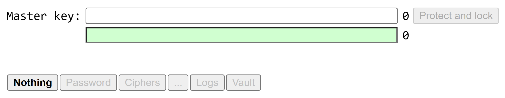

### Master key

The `Master key` field is where you enter your master key, which is the only "password" you should ever have to remember.

The green field below is just a convenience field for you to retype your master key, if it turns green, it means both fields match, if it turns red, they don't, as simple as that.

This is useful when you work fully offline and when you create your very first passwords or ciphers, you need to make extra sure they are not generated with the wrong master key.

The button `Protect and lock` removes your master key from the UI text element and stores it in memory. This is to avoid a person with physical access to your machine to be able to copy and paste it somewhere readable.

> **Note**
> The master key should be quite long and unpredictable.
> For this purpose, I recommend to use Diceware™
>
> You can find a web-based implementation at https://tanukisharp.github.io/Diceware/ ([details](https://github.com/TanukiSharp/Diceware))

### Nothing tab

This tab is just here if you want to hide content, if you have visitors or what.

### Password tab

This is where you can generate a password.

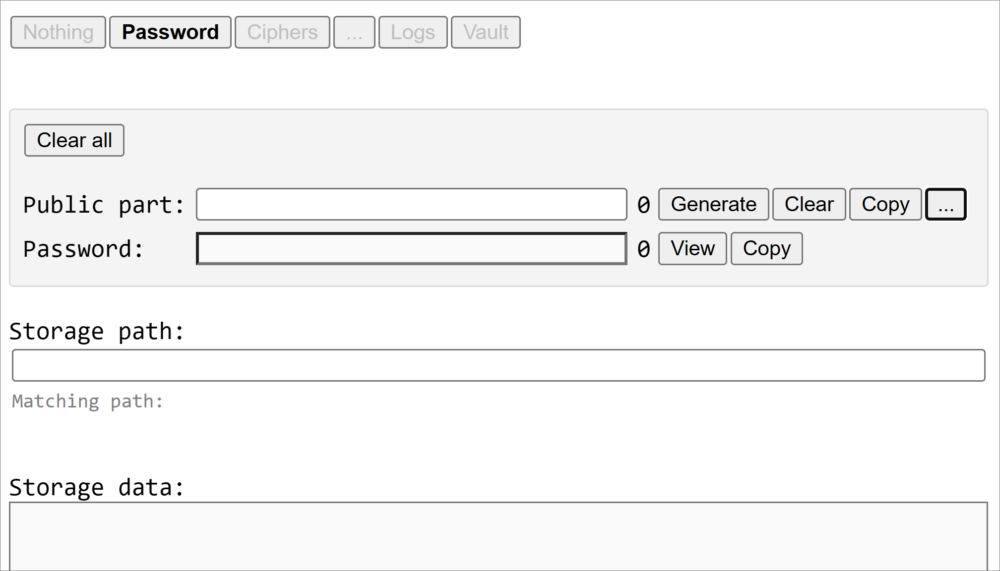

### Ciphers tab

This is where you can encrypt and decrypt any text content. (it should be named `Cipher` actually)

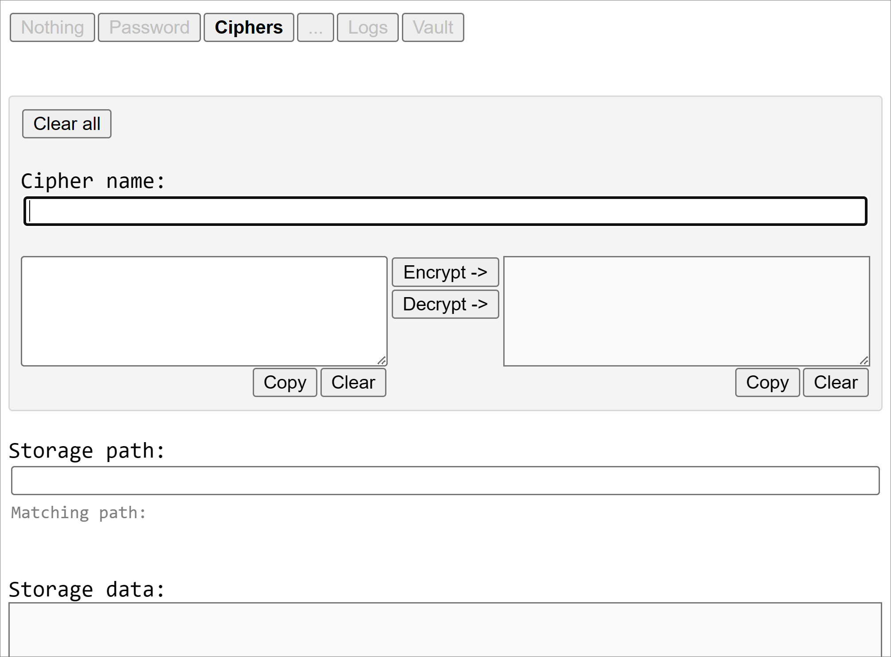

### Re-encrypt tab

This tab is named `...` to keep it short and avoid taking too much space in the UI, because it is almost never used, is experimental, and probably buggy. Let's skip it for now.

### Logs tab

This tab is supposed to show errors when they occur, in order to debug issues when a developer console is not accessible (thank you mobile browsers), but so far it's not working great. 🫤 Let's skip it too.

### Vault tab

This is where you will be able to load and save information about your passwords and ciphers. This tab will require an internet access, but all sensitive data is encrypted with your master key.

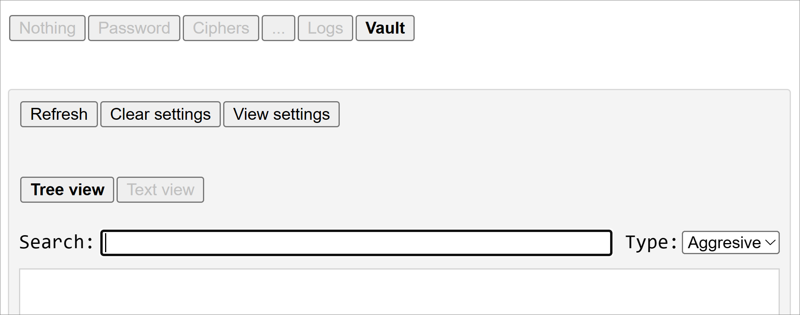

For now, only GitHub storage is supported, but the application is designed to be extended with other types of vault. To access GitHub, you will need a personal access token. Your GitHub personal access token is stored in the browser's local storage, encrypted with your master key.

More details on the personal access token later.

When the vault is fetched successfully, that means GitHub access was granted, which means your personal access token was successfully decrypted, which means your master key is correct, and so the `Master key` field is automatically "protected and locked", just as if you had clicked on the `Protect and lock` button.

## How it works

### Generate a password

1. Input your master key in the `Master key` field.
2. Go to the `Password` tab.
3. Type something in the `Public part`. You can also click the `Generate` button to get a unique public part, if you don't care about remembering it.<br/>
Note that as you type, once the public part is long enough, a password is generated in the `Password` field and it is also copied to the clipboard for you to paste it somewhere later on, if the `Copy` button flashed green. If it flashed red, that means something failed.
    - You can set some options if you need to, by clicking the `...` button:
    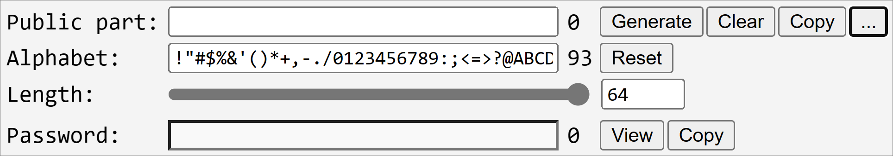
    Here the fields `Alphabet` and `Length` appear, the former let you choose the available characters that can end up in the generated password, the latter let you choose the generated password length.
4. Copy (if not already done) the password generated in the `Password` field and use it anywhere needed.

For a given master key and a given public part, the same password is generated, so if the public part changes, you get a different password, and that's all the point.

Of course if you type a given public part correctly but make a mistake in your master key, you get the wrong password, so watch out.

The public part is something you have to remember if you do not use the vault feature. To be honest, remembering the public part for all the services you use can be quite challenging, so the vault is getting handy, and in this case, because you do not have to remember the public part, you can just generate it with the `Generate` button.

> **Warning**
> At least for GitHub, the public part should be something you know and remember.<br/>
> If you generate a random string, and you push it to your vault, then when you need to setup a new device, you will need your password to access GitHub, and the public part to generate your GitHub password will be in your vault, in GitHub, and you will have locked yourself out.

### Encrypt / decrypt

1. Input your master key in the `Master key` field.
2. Go to the `Ciphers` tab.
3. Type a cipher name in the `Cypher name` field. This is just for you to understand what cipher it is, and is only relevant when you store your cipher in the vault.
4. Type what you want to encrypt or decrypt in the box below on the left, and click either the `Encrypt` or `Decrypt` button for your clear text to be encrypted in the box on the right, or your encrypted text to be decrypted and appear in the box on the right.
    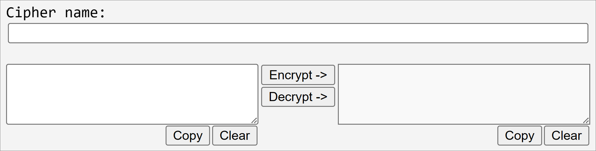

## How to use the vault

### Create a vault

For the moment, ItchyPassword has only one vault storage implementation, and it is based on GitHub repository, meaning that your data is stored in a JSON file in a GitHub repository, and pushing changes is actually making commits to the repository, so your data is also versioned and can be reverted in case of problem.

So first, you will need a GitHub account.

You can create an account very quickly and for free if you don't already have one. Just go to https://github.com and sign up.

By the way, if you are just about to sign up, I recommend you to already use ItchyPassword to create your GitHub password.

Quick summary if you didn't read the sections above:

1. Open https://tanukisharp.github.io/ItchyPassword/ in a web browser.
2. In the `Master key` field, type your master key.
3. In the `Password` tab, type a public part. I recommend `github.com/<your-email-address>`, but anything long enough and that you will always remember for sure will do.
4. Copy the resulting password in the `Password` field in order to use it. (ItchyPassword does it for you though)

Here I assume you know how to use GitHub, teaching you that is beyond the scope of this document.

Once you have a GitHub account and you are logged in, create a repository that will be used to store your data. By convention, name it `ItchyPasswordVault`, but you are really free to name it as you please.

### Setup your vault

1. Open https://tanukisharp.github.io/ItchyPassword/ in a web browser.
2. Enter your master key in the `Master key` field.
3. Go to the `Vault` tab
4. Click the `Refresh` button. This will trigger the setup procedure since it is not setup yet.
5. A dialog should open asking you for a username:
    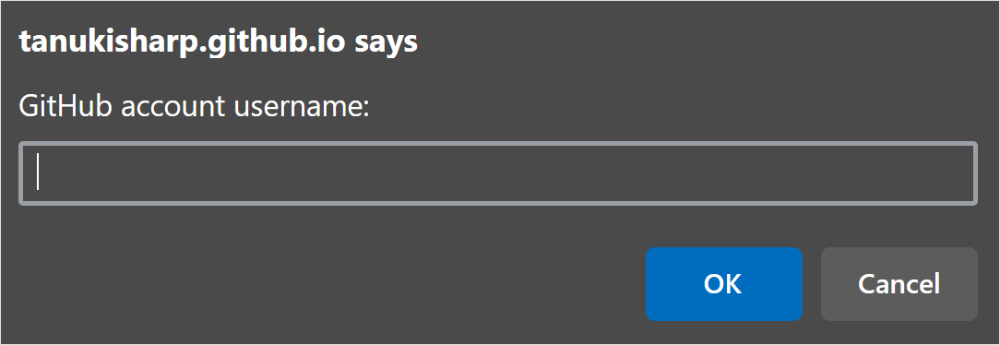
    Enter the username you used to create your GitHub account. Note that this is not your email address.
6. In the next dialog, you are asked to enter a GitHub repository name:
    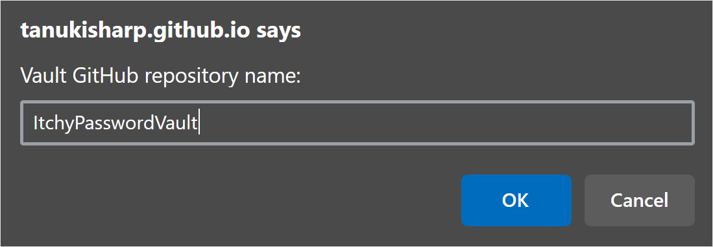
    Enter the name of the repository you created to store your vault data. The field is pre-filled with the value `ItchyPasswordVault`, but you have to enter the name of the repository you created.
7. In the next dialog, you are asked to type the name of your vault file:
    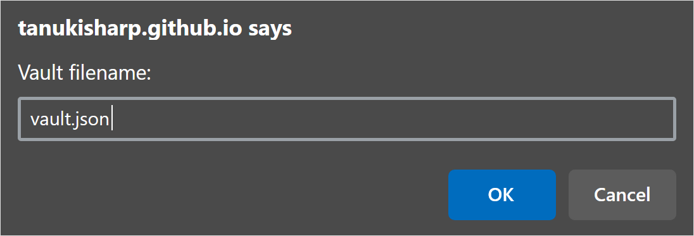
    You can name the file that will store your data the way you want. By default the value `vault.json` is pre-filled, but again, this is a free field.
8. In the next (and last) dialog, you are asked to enter a `Personal access token`:
    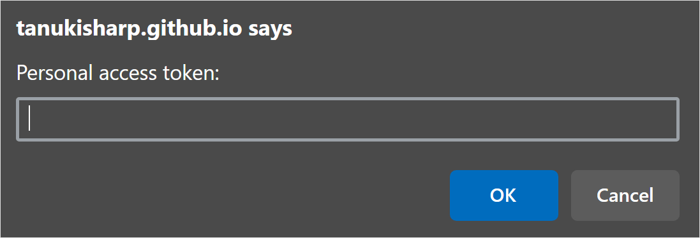
    **Note:** I detail the procedure to generate a personal access token in the next section.<br/>
    This token is for GitHub to grant you access to the `ItchyPasswordVault` repository. This is required to fetch the data file from GitHub, and also to push changes to the data file back to GitHub.
9. Once you have a personal access token, it is encrypted with your master key and stored in the browser's local storage. That's why you needed to enter your master key first, at step 2.<br/>
Anyway, if you click the `Refresh` button of the `Vault` tab without having a master key entered first, ItchyPassword tells you that you must enter a master key first, to make sure you can't accidentally paste a personal access token that would not be persisted, or even worst, persisted in clear. 😱

Once the procedure is done, the `Refresh` button should flash green to indicate that everything went according to plan. Otherwise, the button will flash red to indicate that an error occurred.

In case of failure, you are mostly clueless, unfortunately. The `Logs` tab is supposed to help, but most of the time, it doesn't, sorry about that. 🫤

In case of success, your browser has an encrypted personal access token in its local storage, meaning that:
- on another browser or in another session of the same browser, you won't have this token
- only your master key can make this token usable (decrypt).
- from now on, you will only need to type your master key and click the `Refresh` button in order to get your vault loaded

### Generate a personal access token (on GitHub)

The procedure described below is correct as of April 2023.<br/>
Note that by the time you read it, it may have change on GitHub side and not updated here.

1. Open https://github.com and log in.<br/>
    If you are setting up things on a new device:

    a. Open [ItchyPassword].
    b. Enter your master key in `Master key` field.
    c. Enter your predictable public part for GitHub, such as `github.com/<your-email-address>`.
    d. Login to GitHub with the generated password in the `Password` field.

2. Once logged-in to GitHub, find the `Settings`, then `Developer settings`, then `Personal access tokens`.

3. Here you can choose `Tokens (classic)` or `Fine-grained tokens`.

    I recommend `Fine-grained tokens`, but the classic will do too.

4. Click on the `Generate new token` button.

5. On the token creation page, for the field `Token name` (or `Note` if you chose `Tokens (classic)`), I recommend to name the token `ItchyPassword (<user> / <device-type> / <browser-name>)`, but again, this field is completely up to you.

    > **Warning**
    > As of now, the fine-grained token name is limited to 40 characters, which clearly sucks in my opinion. I opened an issue to ask, but nobody gives a damn.
    > https://github.com/orgs/community/discussions/41568

    The reason for specifying all this is (user, device type and browser), is because:

    - `user`: you may at some point need to generate a token for another person, like your child
    - `device`: you may want to know on which device this token is stored, in case you loose this device, you know which token to invalidate
    - `browser`: you may use several browsers on the same device, and each will need its own token

    Here are some examples with my naming convention:

    - `ItchyPassword (Alice / Living room TV desktop / Edge)`
    - `ItchyPassword (Bob / Pixel 6a / Chrome)`
    - `ItchyPassword (Bob / Pixel 6a / Firefox)`

6. For the `Expiration` field, you can safely set 90 days, but avoid setting a longer duration.<br/> This means you will have to re-generate a new token every 90 days (3 months), but re-generating is much simpler.

7. For the last setting:

    a. If you chose `Tokens (classic)`, then for the field `Select scope`, check the `repo` box, and your screen should look like this:
    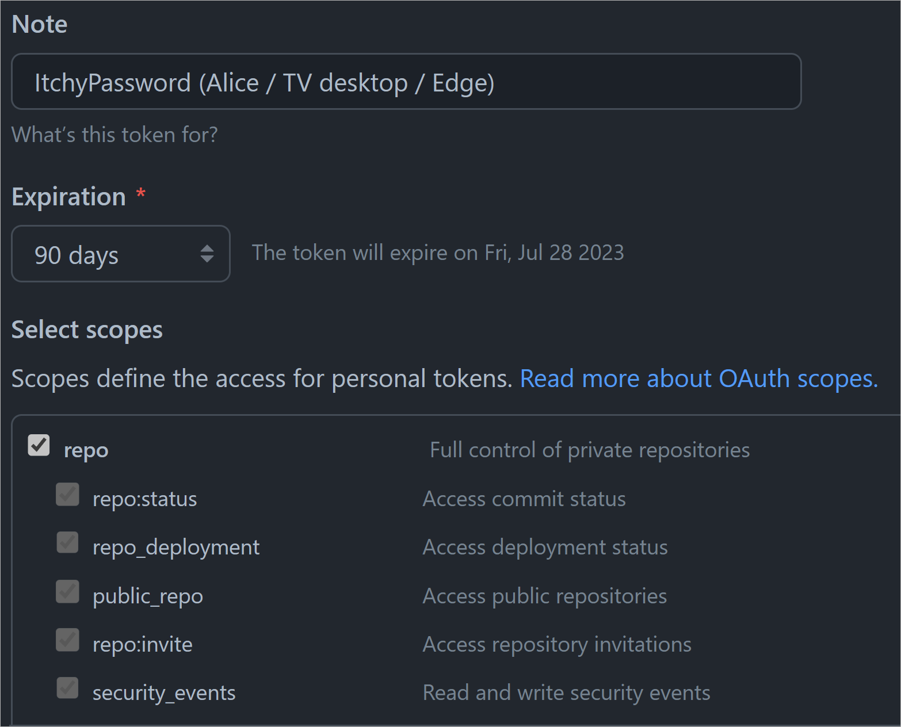

    b. If you chose `Fine-grained tokens`, then:

    - Set a `Description` if you want. Can be useful if the `Token name` field is too limiting.
    - Make sure the `Resource owner` is set to you (or the right owner)
    - In the `Repository access` section, you must select `Only select repositories`, and select only your "ItchyPasswordVault" repository. This is all the point of fine-grained tokens, they can be limited to a given set of repositories.
    - In the `Permissions` section, unfold the `Repository permissions` section, find the `Contents` sub-section and set the `Access` dropdown to `Read and write`.

    Your screen should look like this:
    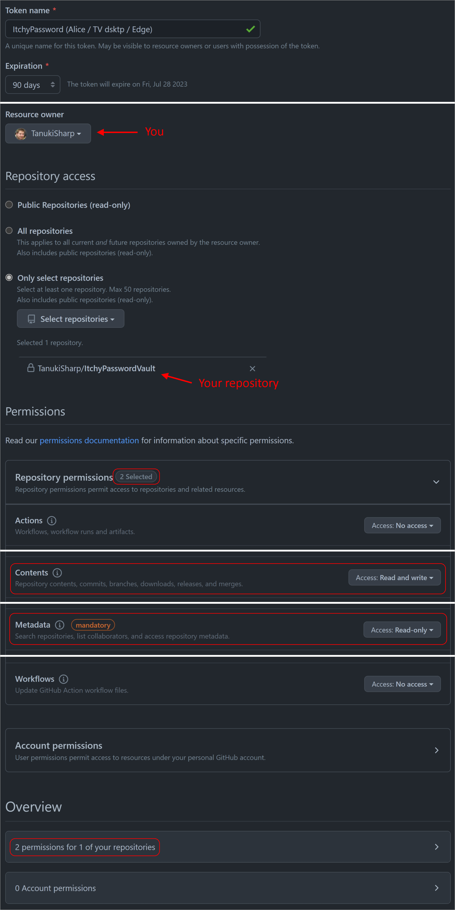
    **Note** that `Metadata` permission is mandatory and will automatically be set to `Read-only`.

8. Finally, click the `Generate token` button.<br/>
    You should end up on a page with a token that you can copy to the clipboard. This is the personal access token you have to provide to ItchyPassword in the `Vault` tab.

## Details

### Passwords generation

#### Version 1

Input elements are:

1. The user's master key (string converted to UTF-8 bytes)
2. A public key (string converted to UTF-8 bytes)
3. A purpose value (string converted to UTF-8 bytes)

A derived key is computed using [PBKDF2] from `1`, using `2` as salt, [SHA-512] as hash algorithm with 100000 iterations.
Then, `3` is hashed using [HMAC] [SHA-512] algorithm with 256 bits from the derived key as the secret.
The output of the hash is the final password to be used, which is then encoded using a custom alphabet.

[HMAC]: https://en.wikipedia.org/wiki/HMAC
[SHA-512]: https://en.wikipedia.org/wiki/SHA-2
[PBKDF2]: https://en.wikipedia.org/wiki/PBKDF2
[ItchyPassword]: https://tanukisharp.github.io/ItchyPassword/
